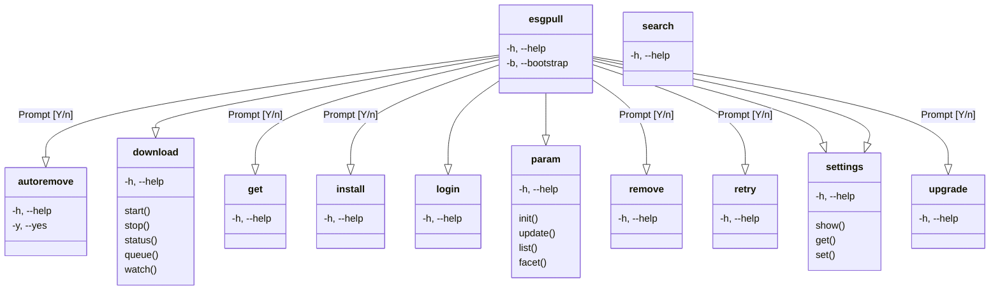

# esgpull - ESGF data management utility

`esgpull` is a tool that simplifies usage of the [ESGF Search API](https://esgf.github.io/esg-search/ESGF_Search_RESTful_API.html) for data discovery, and manages procedures related to downloading and storing files from ESGF.

```py
import esgpull

c = esgpull.Context()
c.query.project = "CMIP6"
print(c.query)
print("Number of CMIP6 datasets:", c.hits)
```

## Features

- Command-line interface
- HTTP download (async multi-file)

## Usage

```sh
$ esgpull --help
Usage: esgpull [OPTIONS] COMMAND [ARGS]...

  esgpull is a management utility for files and datasets from ESGF.

Options:
  -v, --version  Show the version and exit.
  -h, --help     Show this message and exit.

Commands:
  autoremove
  download
  get
  install
  login
  param
  remove
  retry
  search      Search datasets/files on ESGF
  settings
  upgrade
```


### CLI


