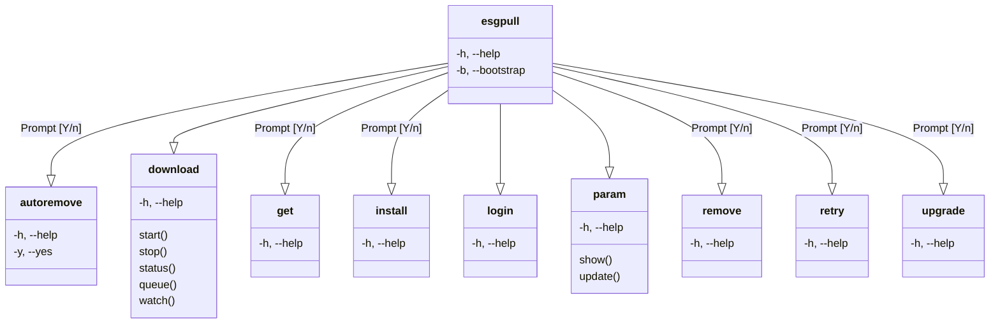

# esgpull - ESGF data management utility

## Introduction

esgpull is a minimal command line utility for local management of ESGF datasets / files.

It helps with discovery, download and version control of datasets uploaded on ESGF nodes.

```python
from esgpull import Storage, StorageMode

## Open a `:memory:` sqlite database
store = Storage(mode=StorageMode.Sqlite, path="path/to/db")
print(store.semver)
# 4.0.0
```

## Features

- Command-line interface
- HTTP download (async multi-file)

## Usage

```sh
~/ipsl/esg-pull master ×
› esgpull --help
Usage: esgpull [OPTIONS] COMMAND [ARGS]...

Options:
  -h, --help  Show this message and exit.

Commands:
  autoremove
  download
  get
  install
  login
  param
  remove
  retry
  upgrade
```


### CLI

[Documentation](https://click.palletsprojects.com/en/8.1.x/#documentation)


