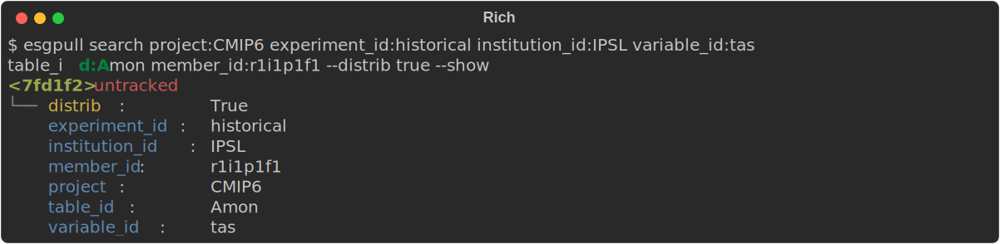
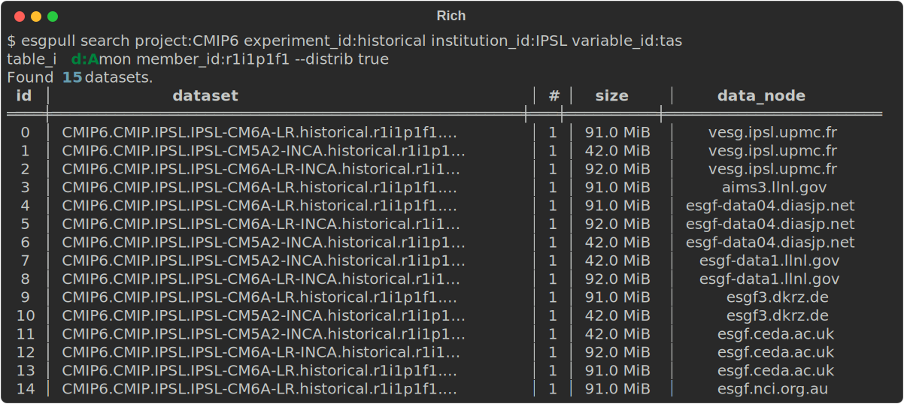
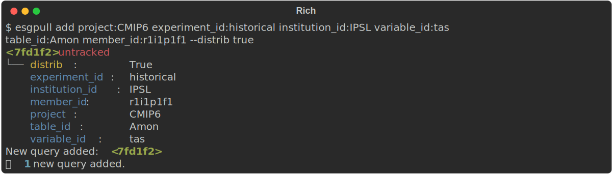
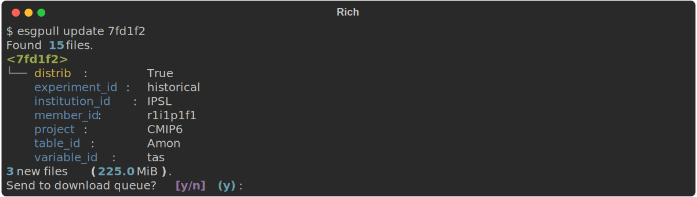
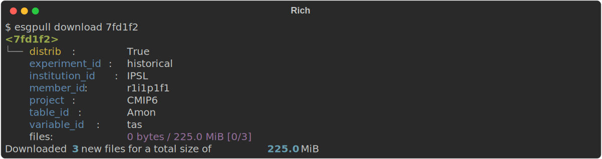

With `esgpull`, downloading files is done after a few steps gradually altering the state of the *query* that is to be downloaded.

!!! note "Datasets or files?"

    In the [search page](../search.md), we only talked about datasets, whereas this document mentions files.

    For searching, datasets are used by default, since each file in a single dataset holds the same metadata.
    Then it makes sense to show datasets when exploring data.

    `esgpull` only uses files in the database and for everything related to download.

To make things easier to explain, we will use the following example query in this document:

```shell
$ esgpull search project:CMIP6 experiment_id:historical institution_id:IPSL variable_id:tas table_id:Amon member_id:r1i1p1f1 --distrib true --show
```


Our query, named `<7fd1f2>`, corresponds to the following 15 datasets:



## Adding a query

The first necessary step is to add `<7fd1f2>` to the database.
Simply replace `search` with `add` and remove any flags specific to the search command, in our case we need to remove `--show`.

```shell
$ esgpull add project:CMIP6 experiment_id:historical institution_id:IPSL variable_id:tas table_id:Amon member_id:r1i1p1f1 --distrib true
```


!!! note "Option flags"

    Notice how we keep the `--distrib true` option flag. This is due to the fact that options (`distrib`, `latest`, `replicas`, `retracted`) are part of the query, since different values on these optoins yield different sets of files.

`<7fd1f2>` is now stored in the database, but it remains **untracked**.


## Tracking a query

A query is untracked by default, to prevent downloading too much data by mistake.
When a query is tracked, it will always be checked for new files on later usage of the `update` command, if it is provided no arguments.

There are 2 ways to track a query:

- use the `track` command with the query id as an argument,
- use the `--track` flag on the `add` command to have it tracked directly.

```shell
$ esgpull track 7fd1f2
```


## Updating a query

To associate a query with actual files, it needs to be **updated**.

Updating a query will send requests to the ESGF search api to fetch metadata for each file corresponding to the query. Any file that is not already in the database is added and **linked** to the query. Files already in the database are simply linked to the query. This would happen for example if a file was previously fetched with another query.

For those familiar with package managers such as `apt`, the `update` command should feel familiar with how those require update *lists* to fetch latest versions of packages before actually downloading (and installing in this case).

```shell
$ esgpull update 7fd1f2
```


!!! note "Replicas"

    For this update, only 3 files were found from the initial 15, this is due to most of them being replicas.

    Currently the choice of data node from which to download the files is simply whichever comes first.


## Downloading

All that remains after these steps is to download the files:

```shell
$ esgpull download
```


### Configuration

RAM usage for downloads is bounded by the following formula:

```
RAM = Config::download.max_concurrent * Config::download.chunk_size
```

### Failed downloads

For each failed download, their status will be set to **error**.

Those can be put back to the download queue, by using the `retry` command.

```shell
$ esgpull retry --help
```
```{.sh .markdown .result}
Usage: esgpull retry [OPTIONS] [[new|queued|starting|started|pausing|paused|er
                     ror|cancelled|done]]...

Options:
  -a, --all
  -v
  -h, --help  Show this message and exit.
```

!!! tip "Cancelled download"

    If `esgpull` has been stopped with with ++ctrl+c++ while downloading, all incomplete downloads will have the `cancelled` status.

    By default, `retry` will put both **error** and **cancelled** downloads back to the queue.

!!! tip "Unexpected errors"

    Some unexpected errors might break `esgpull`. In this case, the downloads will stay in a transient status **starting**.

    The `retry` command will not send those to the queue by default. It can still be done using either:

    * `esgpull retry starting` to send only those back to the queue
    * `esgpull retry --all` to send every download back to the queue (except `done` downloads of course)

### Nodes with untrusted SSL certificates

    Some data nodes may have untrusted SSL certificates.

    Since esgpull uses SSL verification by default, there is a configuration option `download.disable_ssl` to bypass this behaviour.

    SSL verification can also be bypassed for a single download using the `--disable-ssl` flag for the `esgpull download` command.
