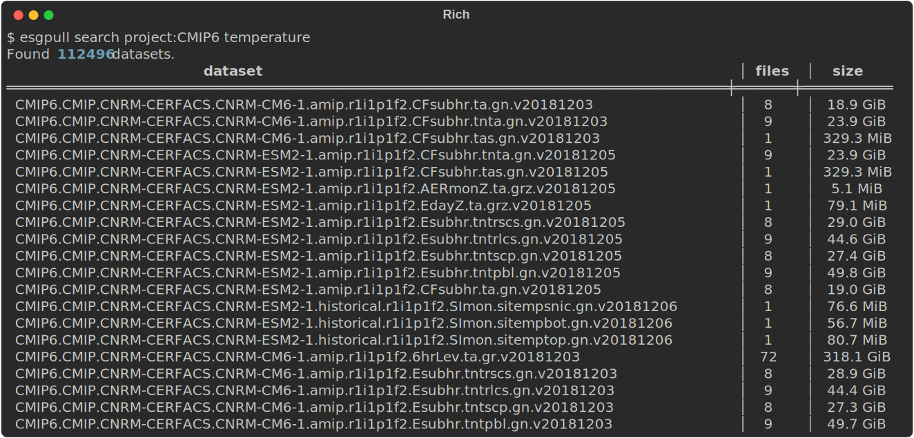

# Introduction

`esgpull` is a modern ESGF data management tool, bundled with a custom asynchronous interface with the [ESGF Search API].
It handles scanning, downloading and updating **datasets**, **files** and *queries* from ESGF.

<!-- Its simple data model makes `esgpull` easy to use, it is completely possible to never download a single file and still find a use for it. -->

## Feature highlight

- Simple syntax for fast data exploration
- Asynchronous download
- Highly configurable

!!! tip "Search datasets"

    `esgpull` allows multiple ways for searching ESGF data, with **facet** and **free-text** terms together with **options**.

    === "Facet terms"

        ```sh title="Query every CMIP6 dataset using facet syntax"
        esgpull search project:CMIP6
        ```
        

    === "Free-text terms"

        ```sh title="Narrow down the results with free-text term 'temperature'"
        esgpull search project:CMIP6 temperature
        ```
        

    === "Facets hints"

        ```sh title="Find out which facets remain to be set with --facets"
        esgpull search project:CMIP6 temperature --facets
        ```
        

    === "Hints"

        ```sh title="Get every potential facet value for the current query with --hints"
        esgpull search project:CMIP6 temperature --hints variable_id
        ```
        

    === "Finer grain query"

        ```sh title="Query all CMIP6 datasets with variable 'tas'"
        esgpull search project:CMIP6 variable_id:tas
        ```
        

    === "Date filter"

        ```sh title="Query CMIP6 datasets with variable 'tas' published since Jan 1st, 2023"
        esgpull search project:CMIP6 variable_id:tas --from 2023-01-01
        ```
        

<!-- !!! tip "Asynchronous downloads" -->
<!---->
<!--     Concurrent download to maximise -->
<!---->
<!-- !!! tip "SQLite database" -->
<!---->
<!--     Each download is recorded in a SQLite database -->

## Setup

Run `$ pip install esgpull` to install the latest release and its dependencies.

Have a look at the [Installation page](installation) for more ways to install.

## Quickstart

Jump directly to the [Quickstart guide](quickstart) to get to know how to use `esgpull`.


<!-- [ESGF portal]: https://esgf-node.ipsl.upmc.fr/search/cmip6-ipsl -->
[ESGF Search API]: https://esgf.github.io/esg-search/ESGF_Search_RESTful_API.html
