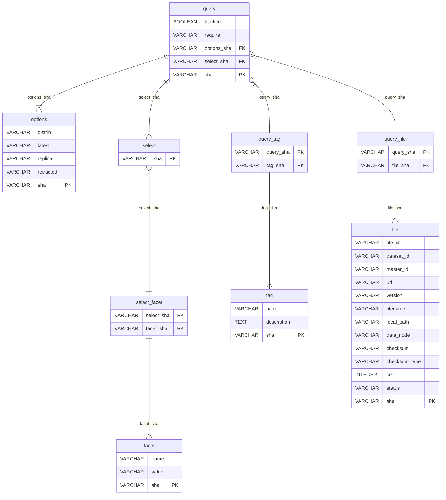

Queries are first-class in esgpull.

## Database schema

!!! tip "For reference"

```mermaid
erDiagram

  query {
    BOOLEAN tracked
    VARCHAR require
    VARCHAR options_sha FK
    VARCHAR select_sha FK
    VARCHAR sha PK
  }

  options {
    VARCHAR distrib
    VARCHAR latest
    VARCHAR replica
    VARCHAR retracted
    VARCHAR sha PK
  }

  select {
    VARCHAR sha PK
  }

  select_facet {
    VARCHAR select_sha PK
    VARCHAR facet_sha PK
  }

  facet {
    VARCHAR name
    VARCHAR value
    VARCHAR sha PK
  }

  query_tag {
    VARCHAR query_sha PK
    VARCHAR tag_sha PK
  }

  tag {
    VARCHAR name
    TEXT description
    VARCHAR sha PK
  }

  query_file {
    VARCHAR query_sha PK
    VARCHAR file_sha PK
  }

  file {
    VARCHAR file_id
    VARCHAR dataset_id
    VARCHAR master_id
    VARCHAR url
    VARCHAR version
    VARCHAR filename
    VARCHAR local_path
    VARCHAR data_node
    VARCHAR checksum
    VARCHAR checksum_type
    INTEGER size
    VARCHAR status
    VARCHAR sha PK
  }

  query ||--|{ options : "options_sha"
  query ||--|{ select : "select_sha"
  select  }|--|| select_facet : "select_sha"
  select_facet ||--|{ facet : "facet_sha"
  query  }|--|| query_tag : "query_sha"
  query_tag ||--|{ tag : "tag_sha"
  query  }|--|| query_file : "query_sha"
  query_file ||--|{ file : "file_sha"
```
