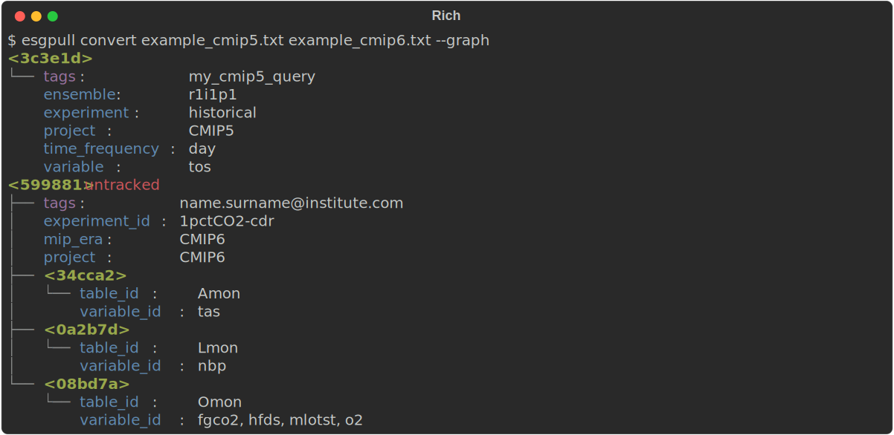

`esgpull` is a tool that simplifies usage of the [ESGF Search API] for data discovery, and manages procedures related to downloading and storing files from ESGF.

To get started, follow [Installation](../installation) to set up a local `esgpull` install.


## Data discovery

For a detailed explanation of the `search` command, read the [data discovery page](../search).

### Search/add workflow example

```shell
$ esgpull search project:CMIP6 variable_id:tas experiment_id:'ssp*' member_id:r1i1p1f1 frequency:mon
$ esgpull search project:CMIP6 variable_id:tas experiment_id:'ssp*' member_id:r1i1p1f1 frequency:mon --show
$ esgpull search project:CMIP6 variable_id:tas experiment_id:'ssp*' member_id:r1i1p1f1 frequency:mon --detail 0
$ esgpull add project:CMIP6 member_id:r1i1p1f1 frequency:mon --tag cmip6_monthly
$ esgpull add --require cmip6_monthly variable_id:tas experiment_id:ssp245 --track
$ esgpull add --require 2ddfa0 variable_id:tas experiment_id:ssp585 --track
```

## Converting synda selection files

If you have existing selection files written for `synda`, you can convert those with no manual editing, using the `convert` command.

!!! tip "Tagging"

    If the first comment of a selection file contains a single word (symbols included, to allow emails),
    it will be used as a tag on the converted query.

We will use these 2 selection files as examples:

```ini title="example_cmip5.txt"
# my_cmip5_query
project=CMIP5
experiment=historical
frequency=day
ensemble=r1i1p1
variable=tos
```

```ini title="example_cmip6.txt"
# name.surname@institute.com
mip_era=CMIP6
project=CMIP6
priority=10900
experiment_id=1pctCO2-cdr
variable[Amon]=tas
variable[Lmon]=nbp
variable[Omon]=fgco2 mlotst hfds o2
```

Running the `convert` command with `--graph` will print the graph of queries the way it would appear after being added to the current install:

```shell title="Convert example"
$ esgpull convert example_cmip5.txt example_cmip6.txt --graph
```


Notice how the "root" query from `example_cmip6.txt` is shown as `untracked`. This is done such that the root query's corresponding datasets are not installed.

Since the root query always corresponds to a superset of the datasets return by any of its sub-queries, it would be pointless to download every dataset from the root query.

### Adding converted queries

To add the queries obtained from converting the selection files, they must first be exported to a yaml representation with:

```shell
$ esgpull convert example_cmip5.txt example_cmip6.txt --out examples_converted.yaml
```

Adding them is done through the `add` command, under the parameter `--query-file`:

```shell
$ esgpull add --query-file examples_converted.yaml
$ esgpull show
```


## Downloading

```shell
$ esgpull update <id>
$ esgpull show
$ esgpull download <id>
$ esgpull status
```

Loop at the [download page](../download) for more information.


[ESGF Search API]: https://esgf.github.io/esg-search/ESGF_Search_RESTful_API.html
