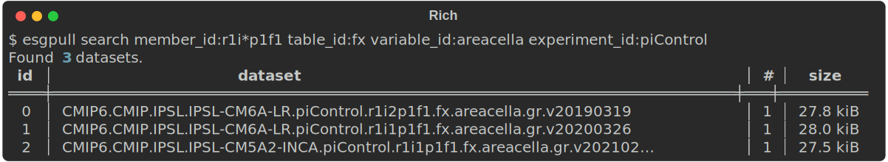

There are two ways to search for datasets with `esgpull`: **facet** and **free-text** search.
Both are done through the `search` command.

## Facet search

*Facet search* is performed with all terms using the facet syntax `<name>:<value>`, for which both name and value are matched exactly.

```shell title="Search CMIP6 datasets"
$ esgpull search project:CMIP6
```


### Multiple values for a facet

Multiples values can be used by separating each value with a `,` comma.

```shell title="Single variable search"
$ esgpull search variable_id:c2h2 -0
$ esgpull search variable_id:c2h6 -0
```


```sh title="Combine both variables in a single search"
$ esgpull search variable_id:c2h2,c2h6 -0
```


!!! warning "Using spaces "disconnects" values from the facet name"

    


!!! note "If you don't know the facets' names"

    `esgpull` provides a handy way to print out facet names that can be used to refine a query:

    ```sh
    esgpull search variable_id:c2h2,c2h6 --facets
    ```
    

    Using a facet that is **not** in this list will always result in a query with 0 corresponding datasets.

### Ignoring a facet

A facet can be ignored by prepending its name with `!`. In this case, it is not possible to specify other values for this facet.

```sh title="Ignore all datasets from IPSL"
$ esgpull search !institution_id:IPSL
```


## Free-text search

*Free-text search* is performed on any term *not* using the `<name>:<value>` syntax. Each term is sent to the ESGF search API, which uses [Apache Solr] to match results.

!!! warning "Solr syntax"

    *Solr* will always try to match any of the search terms.

    ```sh
    esgpull search surface temperature # will match either `surface` or `temperature`
    ```

    To make sure **all** the words are matched, terms must be separated with `AND` and written between quotes
    ```sh
    esgpull search "surface AND temperature" # will match BOTH `surface` and `temperature`
    ```


## Wildcard syntax

A *wildcard* `*` can be used in both facet (value only) and free-text search, allowing for more controllable search results.

Note that on most shells, the wildcard symbol should be inside `"` quotes, to escape it from being expanded by the shell before `esgpull` receives any input.

```sh title="All initializations for areacella variable from piControl experiments"
$ esgpull search "member_id:r1i*p1f1" table_id:fx variable_id:areacella experiment_id:piControl
```



## Case sensitivity

For *facet search*, the case must match exactly, so `project:cmip6` will give entirely different results than `project:CMIP6`.

In the case of *free-text search*, the opposite is true, case is entirely insensitive, and may lead to funky results.

<!-- ## Selection files -->
<!---->
<!-- While the search command is an already powerful tool for data discovery, its limitations come up quite often. Overcoming those limitations is the primary reason for using **selection files**, a multi-request description syntax. -->
<!---->
<!-- With its **subrequests**, a selection file is conceptually similar to a *single-level tree structure*, for which each subrequest is a leaf that specializes the root request. -->
<!---->
<!-- The number of requests sent to ESGF after expanding the *subrequests* is equal to the number of *subrequests*. -->
<!---->
<!-- A selection file is written using either [Yaml/1.0] or [JSON], Yaml is recommended for its human-readable syntax. -->
<!---->
<!-- !!! note "Syntax Rules" -->
<!--     1. key/value pair ⇒ **facet search** term -->
<!--     :   <div class="grid"> -->
<!--             ```yaml title="Yaml" -->
<!--             <name>: <values> -->
<!--             ``` -->
<!--             ```json title="Json" -->
<!--             { -->
<!--               "<name>": "<values>" -->
<!--             } -->
<!--             ``` -->
<!--         </div> -->
<!---->
<!--     2. `query` keyword ⇒ **free-text** -->
<!--     :   <div class="grid"> -->
<!--             ```yaml title="Yaml" -->
<!--             query: <free-text> -->
<!--             ``` -->
<!--             ```json title="Json" -->
<!--             { -->
<!--               "query": "<free-text>" -->
<!--             } -->
<!--             ``` -->
<!--         </div> -->
<!---->
<!--     3. `requests` keyword ⇒ **subrequest** list -->
<!--     :   <div class="grid"> -->
<!--             ```yaml title="Yaml" -->
<!--             requests: -->
<!--               - <request_1> -->
<!--               - <request_2> -->
<!--             ``` -->
<!--             ```json title="Json" -->
<!--             { -->
<!--               "requests": [ -->
<!--                 "<request_1>", -->
<!--                 "<request_2>" -->
<!--               ] -->
<!--             } -->
<!--             ``` -->
<!--         </div> -->
<!---->
<!--     4. *subrequests* accept **only** facets or free-text (nesting disallowed) -->
<!--     :   <div class="grid"> -->
<!--             ```yaml title="Yaml" -->
<!--             requests: -->
<!--               - <name_1>: <values_1> -->
<!--                 <name_2>: <values_2> -->
<!--                 query: <free-text> -->
<!--             ``` -->
<!--             ```json title="Json" -->
<!--             { -->
<!--               "requests": [ -->
<!--                 { -->
<!--                   "<name_1>": "<values_1>", -->
<!--                   "<name_2>": "<values_2>", -->
<!--                   "query": "<free-text>" -->
<!--                 } -->
<!--               ] -->
<!--             } -->
<!--             ``` -->
<!--         </div> -->
<!---->
<!--     5. each *subquery* **inherits** the root request terms -->
<!--     :   <div class="grid"> -->
<!--             ```yaml title="Yaml" -->
<!--             <name_1>: <values_1> -->
<!--             requests: -->
<!--               - <name_2>: <values_2> -->
<!--               - <name_3>: <values_3> -->
<!--               - query: <free-text> -->
<!--             ``` -->
<!--             ```json title="Json" -->
<!--             { -->
<!--               "<name_1>": "<values_1>", -->
<!--               "requests": [ -->
<!--                 { -->
<!--                   "<name_2>": "<values_2>" -->
<!--                 }, -->
<!--                 { -->
<!--                   "<name_3>": "<values_3>" -->
<!--                 }, -->
<!--                 { -->
<!--                   "query": "<free-text>" -->
<!--                 } -->
<!--               ] -->
<!--             } -->
<!--             ``` -->
<!--             ```yaml title="Expanded query 1" -->
<!--             <name_1>: <values_1> -->
<!--             <name_2>: <values_2> -->
<!--             ``` -->
<!--             ```json title="Expanded query 1" -->
<!--             { -->
<!--               "<name_1>": "<values_1>", -->
<!--               "<name_2>": "<values_2>" -->
<!--             } -->
<!--             ``` -->
<!--             ```yaml title="Expanded query 2" -->
<!--             <name_1>: <values_1> -->
<!--             <name_3>: <values_3> -->
<!--             ``` -->
<!--             ```json title="Expanded query 2" -->
<!--             { -->
<!--               "<name_1>": "<values_1>", -->
<!--               "<name_3>": "<values_3>" -->
<!--             } -->
<!--             ``` -->
<!--             ```yaml title="Expanded query 3" -->
<!--             <name_1>: <values_1> -->
<!--             query: <free-text> -->
<!--             ``` -->
<!--             ```json title="Expanded query 3" -->
<!--             { -->
<!--               "<name_1>": "<values_1>", -->
<!--               "query": "<free-text>" -->
<!--             } -->
<!--             ``` -->
<!--         </div> -->
<!---->
<!--     6. *prefixing* a name with `+` ⇒ *append* values to the root request homonym term -->
<!--     :   <div class="grid"> -->
<!--             ```yaml title="Yaml" -->
<!--             <name_1>: <values_1> -->
<!--             requests: -->
<!--               - <name_1>: <values_replaced> -->
<!--                 <name_2>: <values_2> -->
<!--               - +<name_1>: <values_appended> -->
<!--               - <name_3>: <values_3> -->
<!--             ``` -->
<!--             ```json title="Json" -->
<!--             { -->
<!--               "<name_1>": "<values_1>", -->
<!--               "requests": [ -->
<!--                 { -->
<!--                   "<name_1>": "<values_replaced>", -->
<!--                   "<name_2>": "<values_2>" -->
<!--                 }, -->
<!--                 { -->
<!--                   "+<name_1>": "<values_appended>" -->
<!--                 }, -->
<!--                 { -->
<!--                   "<name_3>": "<values_3>" -->
<!--                 } -->
<!--               ] -->
<!--             } -->
<!--             ``` -->
<!--             ```yaml title="Expanded request 1" -->
<!--             <name_1>: <values_replaced> -->
<!--             <name_2>: <values_2> -->
<!--             ``` -->
<!--             ```json title="Expanded request 1" -->
<!--             { -->
<!--               "<name_1>": "<values_replaced>", -->
<!--               "<name_2>": "<values_2>" -->
<!--             } -->
<!--             ``` -->
<!--             ```yaml title="Expanded request 2" -->
<!--             <name_1>: <values_1>,<values_appended> -->
<!--             ``` -->
<!--             ```json title="Expanded request 2" -->
<!--             { -->
<!--               "<name_1>": "<values_1>,<values_appended>" -->
<!--             } -->
<!--             ``` -->
<!--             ```yaml title="Expanded request 3" -->
<!--             <name_1>: <values_1> -->
<!--             <name_3>: <values_3> -->
<!--             ``` -->
<!--             ```json title="Expanded request 3" -->
<!--             { -->
<!--               "<name_1>": "<values_1>", -->
<!--               "<name_3>": "<values_3>" -->
<!--             } -->
<!--             ``` -->
<!--         </div> -->
<!---->
<!-- !!! example "Selection file for IPCC experiments on surface temperatures" -->
<!---->
<!--     ```yaml title="surface_temperature.yaml" -->
<!--     query: "surface AND temperature" -->
<!--     requests: -->
<!--       - project: CMIP5 -->
<!--         experiment: "rcp*" -->
<!--       - project: CMIP6 -->
<!--         experiment_id: "ssp*" -->
<!--     ``` -->
<!--     ```sh title="Search with selection file" -->
<!--     esgpull search --selection-file surface_temperature.yaml --one -->
<!--     ``` -->
<!--     ```{.markdown .result} -->
<!--     Found 2346 datasets. -->
<!--         ╷          ╷ -->
<!--       # │     size │ id -->
<!--     ╶───┼──────────┼──────────────────────────────────────────────────────────────────────╴ -->
<!--       0 │ 363.9 GB │ cmip5.output1.CNRM-CERFACS.CNRM-CM5.rcp26.day.atmos.day.r1i1p1.v201… -->
<!--         ╵          ╵ -->
<!--     ``` -->

<!-- !!! tip "Synda users" -->

<!--     Since the syntax is completely different from `synda` selection files, an undocumented tool called `translate` is in the repository. -->

<!--     It will handle most common cases, and for the others , a few manual adjustments should fix it. -->


[Yaml/1.0]: https://yaml.org/spec/1.0
[JSON]: https://www.json.org/
[Apache Solr]: https://fr.wikipedia.org/wiki/Apache_Solr
